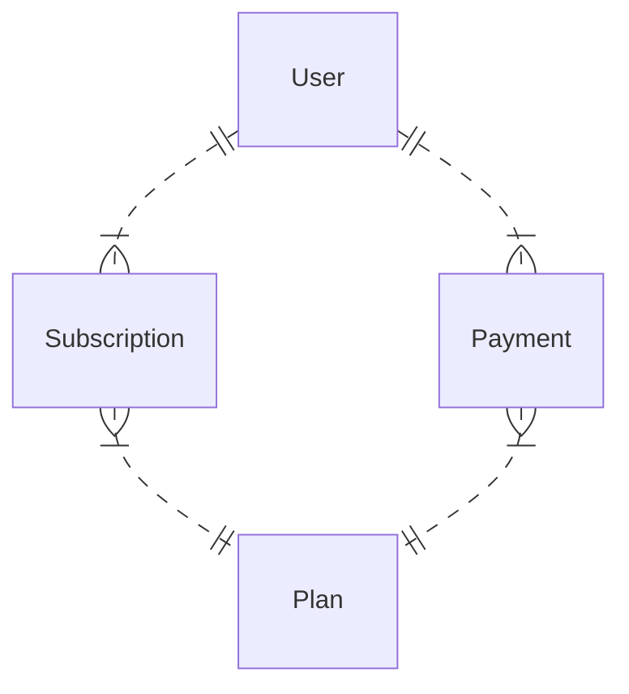

# 2024-12 KNU mysql로 SaaS 비즈니스 분석 맛보기

## 발표자료

- [프레젠테이션](https://gamma.app/docs/MySQL-SaaS--riec12z6nlau1x7)

## 실습 데이터베이스 접속

| property | content                                                   |
| -------- | --------------------------------------------------------- |
| hostname | soohyun-knu.crumymyisb9z.ap-northeast-2.rds.amazonaws.com |
| usename  | knu_hands_on                                              |
| password |                                                           |

```sql
select 1;
use KnuHandsOn;
```

## database

### ER Diagram



### Table Schema

- User
  | column name | type | description
  | ----------- | ---- | ------------
  | id | int | 사용자 ID
  | username | varchar(255) | 사용자 이름
  | email | varchar(255) | 사용자 이메일
  | createdAt | datetime | 생성 시각
  | updatedAt | datetime | 마지막 수정 시각
- Plan
  | column name | type | description
  | ----------- | ---- | ------------
  | id | int | 요금제 ID
  | name | varchar(255) | 요금제 이름
  | price | int | 가격
  | createdAt | datetime | 생성 시각
  | updatedAt | datetime | 마지막 수정 시각
- Subscription
  | column name | type | description
  | ----------- | ---- | ------------
  | id | int | 구독 ID
  | userId | int | 사용자 ID
  | planId | int | 요금제 ID
  | status | varchar(50) | 구독 상태
  | activatedAt | datetime | 생성 시각
  | inactivatedAt | datetime | 마지막 수정 시각
  | createdAt | datetime | 생성 시각
  | updatedAt | datetime | 마지막 수정 시각
- Payment
  | column name | type | description
  | ----------- | ---- | ------------
  | id | int | 구독 ID
  | userId | int | 사용자 ID
  | planId | int | 요금제 ID
  | amouont | int | 결제 금액
  | createdAt | datetime | 생성 시각
